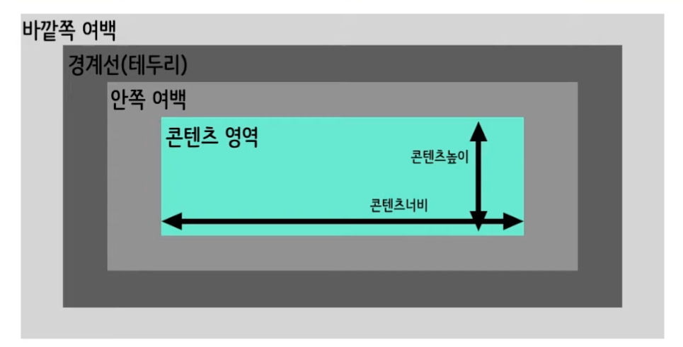

# CSS - 박스 모델
<br>

## 박스 모델
브라우저가 요소를 렌더링 할 때 각각의 요소는 기본적으로 사각형 형태로 영역을 차지하는데,  
이 영역을 '박스'라고 표현하며 CSS는 박스의 크기, 위치, 속성(색, 배경, 테두리 모양 등)을 결정할 수 있다.

하나의 박스는 다음 네 개의 영역으로 구성되고 영역의 크기는 각각의 속성으로 조절한다.


- 콘텐츠 영역: width, height
- 안쪽 여백: padding
- 경계선 (테두리): border-width
- 바깥쪽 여백: margin
<br>


#### 예시
``` html
<!DOCTYPE html>
<html>
<head>
	<meta charset="utf-8">
	<title>HTML 문서</title>
	<style>
		div{
			border: 3px solid red;
			padding: 10px;
			margin: 20px;
			width: 90px; height: 35px;
		}
		/* inline 요소에는 width, height가 적용되지 않는다! */
		span {
			width: 200px;
			height: 200px;
		}
	</style>
</head>
<body>
	<div>요소의 콘텐츠</div>
	<span>check</span>
</body>
</html>
```
<br>

### padding 여백, margin 여백
여백은 상하좌우 네 개의 면에 존재하는 영역이고 각 면에대해 개별적으로 두께를 정의할 수 있다.
- 아래의 하위 속성을 사용해서 개별적으로 설정하거나 단축 속성을 사용해 한 번에 정의할 수 있다.
- padding 하위 속성
	- padding-top
	- padding-bottom
	- padding-left
	- padding-right
- margin 하위 속성
	- margin-top
	- margin-bottom
	- margin-left
	- margin-right
#### 예시
``` html
<!DOCTYPE html>
<html>
<head>
	<meta charset="utf-8">
	<title>HTML 문서</title>
	<style>
		div{
			width: 100px; height: 100px;
			border: 5px solid red;
			padding-top: 10px;
			padding-right: 20px;
			padding-bottom: 30px;
			padding-left: 40px;
			margin-top: 40px;
			margin-right: 30px;
			margin-bottom: 20px;
			margin-left: 10px;
		}
	</style>
</head>
<body>
	<div></div>
</body>
</html>
```
<br>

### box-sizing
요소의 너비(width)와 높이(height) 계산 방식을 지정한다.
- content-box: 기본값, 너비와 높이가 콘텐츠 영역만을 포함한다.
- border-box: 너비와 높이가 안쪽 여백과 테두리까지 포함한다.
<br>

### background
컨텐츠의 background을 정의하고 단축 속성으로 사용이 가능하다.
- background-color: 배경 색상 정의
- background-image: 배경 이미지 정의
- background-position: 배경 이미지의 초기 위치를 정의
- background-size: 배경 이미지의 크기를 정의
- background-repear: 배경 이미지의 반복 방법을 정의
#### 예시
``` html
<!DOCTYPE html>
<html>
<head>
	<meta charset="utf-8">
	<title>HTML 문서</title>
	<style>
		div{
			box-sizing: border-box;
			width: 500px; height: 500px;
			border: 1px solid red;
			background-color: #aab221;
			background-image: url(./image.png);
			background-repeat: no-repeat;
			background-position: center;
			background-size: cover; /* 500px 500px; */
		}
	</style>
</head>
<body>
	<div>헬로우</div>
</body>
</html>
```
