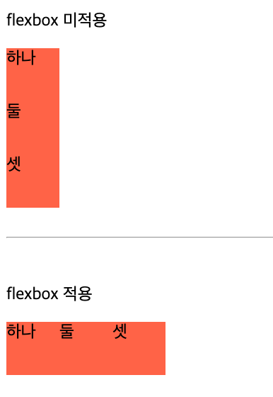

# CSS - flexbox
<br>

## flexbox
> flexbox란 박스 내 요소 간의 공간 배분과 정렬 기능을 제공하기 위한 1차원 레이아웃 모델
- 1차원 모델이라 부르는 이유는 레이아웃을 다룰 때 한 번에 하나의 차원(행 또는 열)만을 다룬다는 특성 때문이다.
- felxbox는 flex 컨테이너라고도 부름 (요소들을 포함하기 때문)
- flex 컨테이너를 만들기 위해서는 컨테이너에 `display: flex;`를 적용해야 함
- 자식 요소가 가지고 있는 margin 값을 무시하고 자신의 진행 방향(기본값은 행 방향)으로 요소를 배치
<div align="center">
  
</div>

위와 같이 flexbox에는 내부 요소의 진행방햐을 의미하는 주축(main-axis)과 교차축(cross-axis)이 있다.  
기본적으로 주측은 가로(행) 방향, 교차축은 세로(열) 방향이지만 사용자는 목적에 따라 주축과 교차축을 서로 바꿔가며 레이아웃을 결정할 수 있음

### flex-direction 속성
flexbox 내 요소를 배치할 때 사용할 주축 및 방향(정방향, 역방향)을 지정한다.
- row: 기본값, 주축은 행이고 방향은 콘텐츠의 방향과 동일
- row-reverse: 주축은 행이고 방향은 콘텐츠의 방향과 반대
- column: 주축은 열이고 방향은 콘텐츠의 방향과 동일
- column-reverse: 주축은 열이고 방향은 콘텐츠의 방향과 반대  

#### 예시
``` html
<!DOCTYPE html>
<html>
<head>
	<meta charset="utf-8">
	<title>HTML 문서</title>
	<style>
		.item{
			width: 80px; height: 80px;
			background: palegoldenrod;
		}
	</style>
</head>
<body>
	<p>flexbox 미적용</p>
	<div>
		<div class="item">1</div>
		<div class="item">2</div>
		<div class="item">3</div>
	</div>
	<br><hr><br>
	<p>flexbox 적용</p>
	<div style="display: flex; flex-direction: column-reverse;">
		<div class="item">하나</div>
		<div class="item">둘</div>
		<div class="item">셋</div>
	</div>
</body>
</html>
```